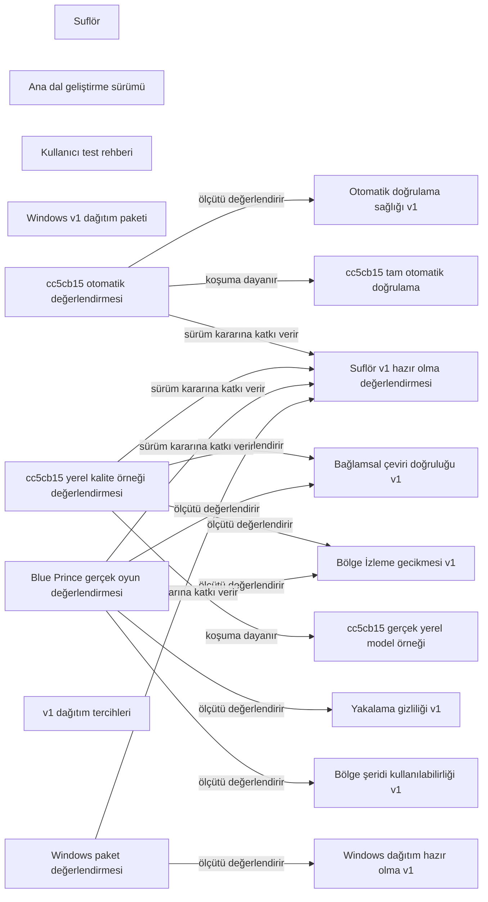

# Suflör v1 — Ontoloji

Revizyon: 0. Canlı görünüm için `ontology` komutunu çalıştır.

## Türler ve özellikler

### Ürün (`product`)

- amac: string; zorunlu; seçenekler: None
### Somut çıktı (`artifact`)

- aciklama: string; zorunlu; seçenekler: None
- surum: string; isteğe bağlı; seçenekler: None
- dosya: file; isteğe bağlı; seçenekler: None
### Başarı ölçütü (`criterion`)

Geçmiş kaydı korunur; farklı içerik için yeni kimlik/sürüm gerekir.

- tanim: string; zorunlu; seçenekler: None
- kategori: string; zorunlu; seçenekler: ['quality', 'performance', 'privacy', 'usability', 'engineering', 'distribution']
- hedef: string; zorunlu; seçenekler: None
- surum: string; zorunlu; seçenekler: None
### Doğrulama koşumu (`verification_run`)

Geçmiş kaydı korunur; farklı içerik için yeni kimlik/sürüm gerekir.

- yontem: string; zorunlu; seçenekler: None
- sonuc: string; zorunlu; seçenekler: ['pass', 'fail']
- ozet: string; zorunlu; seçenekler: None
- kaynak_commit: string; zorunlu; seçenekler: None
- tarih: string; zorunlu; seçenekler: None
### Değerlendirme (`evaluation`)

- karar: string; zorunlu; seçenekler: ['pending', 'pass', 'fail', 'needs_review']
- ozet: string; zorunlu; seçenekler: None
### Dağıtım kararı (`release_policy`)

- uygulama_lisansi: string; zorunlu; seçenekler: None
- paket_secenekleri: string; zorunlu; seçenekler: None
- kod_imzasi: string; zorunlu; seçenekler: None
### Sürüm hazır olma değerlendirmesi (`release_assessment`)

- durum: string; zorunlu; seçenekler: ['pending', 'ready', 'not_ready']
- ozet: string; zorunlu; seçenekler: None

## İlişki kuralları

- ölçütü değerlendirir (`evaluates`): evaluation → criterion; kaynak başına 1..çok, hedef başına 0..çok; etki: reverse
- koşuma dayanır (`based_on_run`): evaluation → verification_run; kaynak başına 0..çok, hedef başına 0..çok; etki: reverse
- sürüm kararına katkı verir (`contributes_to`): evaluation → release_assessment; kaynak başına 0..1, hedef başına 1..çok; etki: forward

## Somut nesneler

- **Suflör** (`suflor`, product): {"amac": "Oyun ekranındaki metni güvenli biçimde yakalayıp bağlamlı Türkçeye çevirmek."}; durum: input; üretici: dış girdi
- **Ana dal geliştirme sürümü** (`current-build`, artifact): {"aciklama": "Yakalama gizliliği, yapışık şerit ve Qwen3 kalite motorunu içeren doğrulanmış ana dal.", "surum": "cc5cb155eeca631858158ec1d5bc98d599da1c0a"}; durum: input; üretici: dış girdi
- **Kullanıcı test rehberi** (`test-guide`, artifact): {"aciklama": "Snapshot, Bölge İzleme ve kalite modeli için uygulanabilir kullanıcı adımları.", "dosya": "docs/KULLANICI_TEST_REHBERI.md", "surum": "cc5cb15"}; durum: input; üretici: dış girdi
- **Windows v1 dağıtım paketi** (`windows-package`, artifact): {"aciklama": "Temiz Windows ortamında sınanacak, modellerden ayrı dağıtım çıktısı."}; durum: pending; üretici: T-PACKAGE
- **Bağlamsal çeviri doğruluğu v1** (`c-quality-v1`, criterion): {"hedef": "Blue Prince gerçek oyun örnekleri kullanıcı tarafından incelenir; kesin örnek sayısı ve geçme eşiği açık sorudur.", "kategori": "quality", "surum": "v1", "tanim": "Çeviri anlamı ve mantıksal ilişkileri korur; ipucu, sayı ve zorunlu oyun terimlerini bozmaz; açıklanamayan kaynak dil kalıntısı bırakmaz."}; durum: input; üretici: dış girdi
- **Bölge İzleme gecikmesi v1** (`c-latency-v1`, criterion): {"hedef": "Cache isabeti en çok 160 ms; cache ıskası en çok 320 ms; oyun FPS düşüşü en çok yüzde 3.", "kategori": "performance", "surum": "v1", "tanim": "Bölge İzleme değişen metni kullanıcıyı bekletmeden işler ve durağan metni yeniden çevirmez."}; durum: input; üretici: dış girdi
- **Yakalama gizliliği v1** (`c-capture-privacy-v1`, criterion): {"hedef": "Windows koruması ve geri dönüş yolu gerçek oyun ekranında doğrulanır.", "kategori": "privacy", "surum": "v1", "tanim": "Snapshot ve Bölge İzleme karelerinde hiçbir Suflör penceresi görünmez."}; durum: input; üretici: dış girdi
- **Bölge şeridi kullanılabilirliği v1** (`c-overlay-usability-v1`, criterion): {"hedef": "Blue Prince içinde gerçek kullanıcı akışında yerleşim, hover, duraklatma, yeniden seçim ve kapatma doğrulanır.", "kategori": "usability", "surum": "v1", "tanim": "Çeviri seçilen alanın üstüne veya gerekirse altına yapışır; metni örtmez; kontroller yalnız gerektiğinde görünür."}; durum: input; üretici: dış girdi
- **Otomatik doğrulama sağlığı v1** (`c-engineering-v1`, criterion): {"hedef": "Tüm pytest testleri geçer ve mypy strict hata vermez.", "kategori": "engineering", "surum": "v1", "tanim": "Ana dalın test ve katı tip denetimi temizdir."}; durum: input; üretici: dış girdi
- **Windows dağıtım hazır olma v1** (`c-distribution-v1`, criterion): {"hedef": "Temiz Windows ortamında açılış ve iki mod duman testi geçer; uygulama paketi modeller hariç en çok 150 MB olur.", "kategori": "distribution", "surum": "v1", "tanim": "Kullanıcı geliştirme ortamı kurmadan Suflör'ü indirip açabilir; üçüncü taraf lisansları ve model indirme yolu pakette bulunur."}; durum: input; üretici: dış girdi
- **cc5cb15 tam otomatik doğrulama** (`run-auto-cc5cb15`, verification_run): {"kaynak_commit": "cc5cb155eeca631858158ec1d5bc98d599da1c0a", "ozet": "2497 pytest testi geçti; 45 kaynak dosyasında mypy hatası yok.", "sonuc": "pass", "tarih": "2026-09-18", "yontem": "pytest -q ve mypy --strict --explicit-package-bases src"}; durum: input; üretici: dış girdi
- **cc5cb15 gerçek yerel model örneği** (`run-quality-sample-cc5cb15`, verification_run): {"kaynak_commit": "cc5cb155eeca631858158ec1d5bc98d599da1c0a", "ozet": "İlk çalışma 3,36 saniye, sıcak çalışma 0,33 saniye; Plan yeniden devrede, Batı Kapısı ve Ön Oda üretildi.", "sonuc": "pass", "tarih": "2026-09-18", "yontem": "Qwen3 4B yerel sağlayıcıyla iki segment, sözlük ve çeviri hafızası içeren örnek koşum"}; durum: input; üretici: dış girdi
- **cc5cb15 otomatik değerlendirmesi** (`eval-automation-cc5cb15`, evaluation): {"karar": "pass", "ozet": "Kayıtlı ana dal koşumunda bütün testler ve tip denetimi geçti."}; durum: input; üretici: dış girdi
- **cc5cb15 yerel kalite örneği değerlendirmesi** (`eval-quality-sample-cc5cb15`, evaluation): {"karar": "needs_review", "ozet": "Örnek bağlam ve zorunlu terimleri kullandı; tek sentetik koşum Blue Prince kalite ve uçtan uca gecikme ölçütlerini kapatmaz."}; durum: input; üretici: dış girdi
- **Blue Prince gerçek oyun değerlendirmesi** (`eval-blue-prince-v1`, evaluation): {"karar": "pending", "ozet": "Gerçek oyun testi henüz yapılmadı."}; durum: pending; üretici: T-BLUE-PRINCE
- **v1 dağıtım tercihleri** (`release-policy-v1`, release_policy): {"kod_imzasi": "pending", "paket_secenekleri": "pending", "uygulama_lisansi": "pending"}; durum: pending; üretici: T-RELEASE-POLICY
- **Windows paket değerlendirmesi** (`eval-package-v1`, evaluation): {"karar": "pending", "ozet": "Temiz Windows paketi henüz üretilip sınanmadı."}; durum: pending; üretici: T-PACKAGE
- **Suflör v1 hazır olma değerlendirmesi** (`v1-readiness`, release_assessment): {"durum": "pending", "ozet": "Otomatik testler temiz; Blue Prince gerçek oyun ve Windows paket kapıları açık."}; durum: pending; üretici: T-V1-READINESS

## Nesne haritası

Oklar kayıtlı ilişki yönüdür; değişiklik etkisinin yönü üstte ayrıca tanımlıdır.

## Görevlerin veri bağları

- **T-BLUE-PRINCE — Blue Prince gerçek oyun kalite ve kullanım kapısını çalıştır**: girdiler [current-build, test-guide, c-quality-v1, c-latency-v1, c-capture-privacy-v1, c-overlay-usability-v1], çıktılar [eval-blue-prince-v1], durum todo.
- **T-RELEASE-POLICY — v1 lisans, paket seçenekleri ve kod imzası kararlarını kapat**: girdiler [suflor], çıktılar [release-policy-v1], durum todo.
- **T-PACKAGE — Temiz Windows v1 paketini üret ve doğrula**: girdiler [current-build, release-policy-v1, c-distribution-v1], çıktılar [windows-package, eval-package-v1], durum blocked.
- **T-V1-READINESS — v1 GitHub dağıtım hazır olma kararını kanıtlarla ver**: girdiler [eval-automation-cc5cb15, eval-quality-sample-cc5cb15, eval-blue-prince-v1, eval-package-v1], çıktılar [v1-readiness], durum blocked.

Etki yeniden inceleme ihtiyacıdır; nesnenin yanlış olduğu hükmü değildir.
